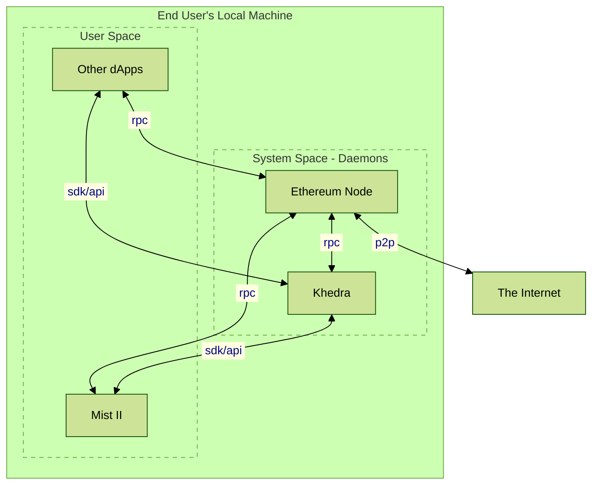

# System Architecture

## High-Level Architecture Diagram

```mermaid
%%{init: {'theme': 'forest', 'themeVariables': { 'primaryColor': '#00ffcc', 'fontSize': '14px' }}}%%

flowchart TB
    subgraph LocalMachine[End User's Local Machine]
        direction TB

        subgraph UserSpace[User Space]
            style UserSpace stroke-dasharray: 5 5,stroke-width 4
            dApp1[Other dApps]
            dApp2[Mist II]
        end

        subgraph Daemons[System Space - Daemons]
            style Daemons stroke-dasharray: 5 5,stroke-width 4
            Node[Ethereum Node]
            Khedra[Khedra]
        end

        dApp1 <--> |"<span style='background-color:lightyellow;padding:4px;color:darkblue'>rpc</span>"| Node
        dApp2 <--> |"<span style='background-color:lightyellow;padding:4px;color:darkblue'>rpc</span>"| Node
        Node <--> |"<span style='background-color:lightyellow;padding:4px;color:darkblue'>rpc</span>"| Khedra
        Khedra <--> |"<span style='background-color:lightyellow;padding:4px;color:darkblue'>sdk/api</span>"| dApp1
        Khedra <--> |"<span style='background-color:lightyellow;padding:4px;color:darkblue'>sdk/api</span>"| dApp2
    end

    Node <--> |"<span style='background-color:lightyellow;padding:4px;color:darkblue'>p2p</span>"| Internet[The Internet]
```
